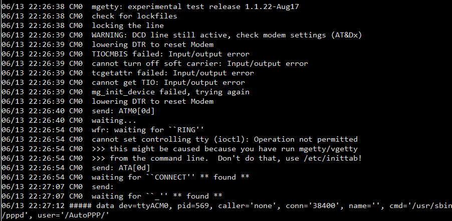

# PC-DC Server on PS2 Linux

A PC-DC Server for connecting a Sega Dreamcast console to the internet can be setup on PS2 Linux with relative ease. Luckily, the software required (mgetty and pppd) to set this up comes pre-installed on PS2 Linux.

## References

* [https://www.dreamcast-talk.com/forum/app.php/page/ryochanpart0](https://www.dreamcast-talk.com/forum/app.php/page/ryochanpart0)
* [http://playstation2-linux.com/project/showfilesbf55.html?group_id=1](http://ps2linux.no-ip.info/playstation2-linux.com/project/showfilesbf55.html?group_id=1)
* [http://playstation2-linux.com/project/shownotes365a.html?release_id=90](http://ps2linux.no-ip.info/playstation2-linux.com/project/shownotes365a.html?release_id=90)


## Preliminary Considerations

This page only describes how to set up the PC-DC Server on PS2 Linux. It does NOT describe how to configure the Dreamcast console to use the PC-DC Server, how to construct or use a voltage line inducer, or any other procedures that may be required to get all of this work. The original PC-DC Server tutorial cited above should be consulted before performing any of the operations outlined on this page. The original tutorial can be followed mostly as-is to get the server working on PS2 Linux. This page should serve as an equivalency to Part 1 and a partial equivalency to Part 3 of the original tutorial.

### Modem Devices

Getting this server setup properly requires the use of a dial-up modem:
* For PS2 Linux Beta Release 1 installations, this requires a [USB Dial-Up Modem](../../USB&#32;Devices/Modems) (as the Japanese Playstatoin 2 Network Adapters only contain an ethernet adapter). 
* For PS2 Linux Release 1.0 installations, this can be accomplished using a [USB Dial-Up Modem](../../USB&#32;Devices/Modems) or the modem included in the North American Playstation 2 Network Adapter.

#### USB Modems

This tutorial assumes that these modem devices are registered as ```/dev/ttyACM0``` (this should be confirmed via ```dmesg``` output). A configuration file leveraged by pppd is created with the filename ```options.ttyACM0```. If the modem device is registered as something else, the file extension should be changed to match the device. Additionally, any ```/dev/ttyACM0``` references in commands below should be changed to the correct device.

#### Network Adapter Modems

To use this device, a customized serial.o kernel distributed through the playstation2-linux.com community (originally available on [this page](http://ps2linux.no-ip.info/playstation2-linux.com/download/ps2linux/serial.o)). This module is compiled for Kernel 2.2.1, and therefore will only work with this kernel version. The module can be loaded as follows (as root or via sudo):
```bash
/sbin/insmod /path/to/serial.o
```

&nbsp;  
This tutorial assumes that these modem devices are registered as ```/dev/ttyS0``` (this should be confirmed via ```dmesg``` output, in which the ```ttyS00``` should be displayed including the extra ```0``` character). A configuration file leveraged by pppd is created with the filename ```options.ttyS0```. If the modem device is registered as something else, the file extension should be changed to match the device. Additionally, any ```/dev/ttyS0``` references in commands below should be changed to the correct device.

### Kernel Support

In the author's experience, the PC-DC Server does NOT work with Kernel 2.4.17_mvl21. The suspected root causes of this are (the author did not perform any additional analysis to confirm and/or resolve the issues):
* mgetty and/or pppd must be compiled against a 2.4.x kernel in order to properly support a PC-DC Server.
* More fine-tuning of mgetty and/or pppd is required to setup a working PC-DC Server on a 2.4.x kernel.

A PC-DC Server setup with a USB modem should work under Kernel 2.2.1 or Kernel 2.2.19. A Server setup with the Network Adapter modem will only work under Kernel 2.2.1.

## Configuring PS2 Linux for a PC-DC Server (as root)

Backup stock configuration files for mgetty
```bash
cp /etc/mgetty+sendfax/dialin.config /etc/mgetty+sendfax/dialin.config.bak
cp /etc/mgetty+sendfax/login.config /etc/mgetty+sendfax/login.config.bak
cp /etc/mgetty+sendfax/mgetty.config /etc/mgetty+sendfax/mgetty.config.bak
```

&nbsp;  
Backup stock configuration files for pppd
```bash
cp /etc/ppp/options /etc/ppp/options.bak
cp /etc/ppp/pap-secrets /etc/ppp/pap-secrets.bak
```

&nbsp;  
Create system user (can be called literally anything, but most often ```dream``` is used, including by the author below) to be used for the PC-DC Server.
```bash
useradd -G dip,users,pppusers -c "Dreamcast user" -d /home/dream -g users -s /usr/sbin/pppd dream
```

&nbsp;  
Set password for newly-created user. A password containing only alphanumerics is recommended by the author (the way in which special characters are interpreted in pppd configuration files is unclear, and therefore special characters are not recommended to be used here).
```bash
passwd dream
```

&nbsp;  
Install [dialin.config](dialin.config), [login.config](login.config), and [mgetty.config](mgetty.config) configuration files for mgetty.
```bash
cp -f /path/to/dialin.config /path/to/login.config /path/to/mgetty.config /etc/mgetty+sendfax/.
chmod 600 /etc/mgetty+sendfax/dialin.config
chmod 600 /etc/mgetty+sendfax/login.config
chmod 600 /etc/mgetty+sendfax/mgetty.config
```

&nbsp;  
Edit the pppd [options](options) configuration file and replace ```X.X.X.X``` with the IP address of the DNS server that the Dreamcast console should use. In most cases, this will be the IP address of the user's home router which also contains a DNS server.

&nbsp;  
Edit the pppd [pap-secrets](pap-secrets) configuration file. Replace ```USERHERE``` with the name of the user created earlier. Replace ```PASSWORDHERE``` with the password for the user.

&nbsp;  
Edit the [options.ttyACM0](options.ttyACM0) configuration file (for USB modems) and/or the [options.ttyS0](options.ttyS0) configuration file (for Network Adapter modems). Replace ```M.M.M.M``` with the subnet mask used by the network that PS2 Linux is connected to (usually ```255.255.255.0```). Replace ```X.X.X.X``` with the start of the range of IP addresses to be allocated by the PC-DC Server (such as ```192.168.1.100```), and replace ```Y.Y.Y.Y``` with the end of the range (such as ```192.168.1.101```).
**NOTE** If setting up files for both types of modem devices, it is completely acceptable and expected if the two configuration files are identical.

&nbsp;  
Install the edited configuration files for pppd
```bash
cp -f /path/to/options /path/to/options.ttyACM0 /path/to/options.ttyS0 /path/to/pap-secrets /etc/ppp/.
chmod 600 /etc/ppp/options
chmod 600 /etc/ppp/options.ttyACM0
chmod 600 /etc/ppp/options.ttyS0
chmod 600 /etc/ppp/pap-secrets
```

## Using the PC-DC Server on PS2 Linux (as root or via sudo)

This procedure requires either two or three open terminal sessions open:
* The first session executes mgetty, which waits for an initial connection from the Dreamcast console. This session is HIGHLY recommended by the author to be established as a local session directly on PS2 Linux (NOT an SSH session).
* The second session is leveraged to send a signal to the mgetty process which "answers the phone" and fully establishes the connection between the Dreamcast console and PS2 Linux. This session can be established either locally on PS2 Linux or via SSH.
* The third session (which is optional, but can be leveraged to diagnose issues) monitors the log file from the mgetty session and displays information indicating the state of the Dreamcast and PS2 Linux connection. This session can be established either locally on PS2 Linux or via SSH.

&nbsp;  
Power on the Dreamcast console, load the game/software that will be connecting to the internet, and navigate to the menu/screen to initiate the dialing sequence. But do NOT initiate the dialing sequence yet!

&nbsp;  
**For USB modem devices:**   
If not done already: On PS2 Linux, load the kernel driver for the USB modem device using the command below, then plug the device in and connect the Dreamcast modem to it.
```bash
/sbin/insmod acm
```

&nbsp;  
**Alternatively: for Network Adapter modem devices:**
If not done already: On PS2 Linux, load the kernel driver for the USB modem device using the command below, then plug the device in and connect the Dreamcast modem to it.
```bash
/sbin/insmod /path/to/serial.o
```

### Setting up connection between Dreamcast and PS2 Linux (as root or via sudo)

**NOTE:** For the commands below, the ```DEVICE``` value should be replaced with ```ttyACM0``` for USB modems and ```ttyS0``` for Network Adapter modems.

In the first session on PS2 Linux: execute mgetty.
```bash
/sbin/mgetty -D /dev/DEVICE -m '"" ATM0'
```

&nbsp;  
In the second session on PS2 Linux: type the following command into the session but DO NOT execute it yet!
```bash
killall -USR1 mgetty
```

&nbsp;  
**(OPTIONAL)** In the third session on PS2 Linux: Execute the following command to display the log file for the mgetty process.
```bash
tail -f /var/log/mgetty.log.DEVICE
```

&nbsp;  
On the Dreamcast console: initiate the dialing sequence.  
In the second session on PS2 Linux: wait about 5 seconds, then execute the ```killall``` command typed out earlier.

&nbsp;  
As long as the above procedure was followed correctly, the Dreamcast console should successfully connect to the PC-DC Server and should receive an internet connection. If the connection is ever closed for any reason, it can be re-established be re-following the steps above.

## Usage Examples

### USB Modem

  
*mgetty process executed with USB modem*

  
*mgetty process log showing successful PC-DC connection*

### Network Adapter Modem

  
*Network Adapter Modem recognized as ttyS0 device after loading serial kernel module*

  
*mgetty process executed with Network Adapter modem*

  
*mgetty process log showing successful PC-DC connection*

### Kernel 2.4.17 (Failed)

  
*mgetty process log shwoing failed PC-DC connection under Kernel 2.4.17*

